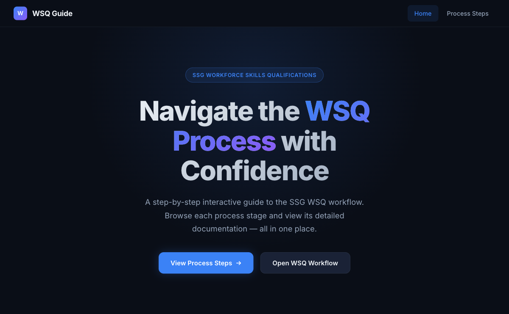
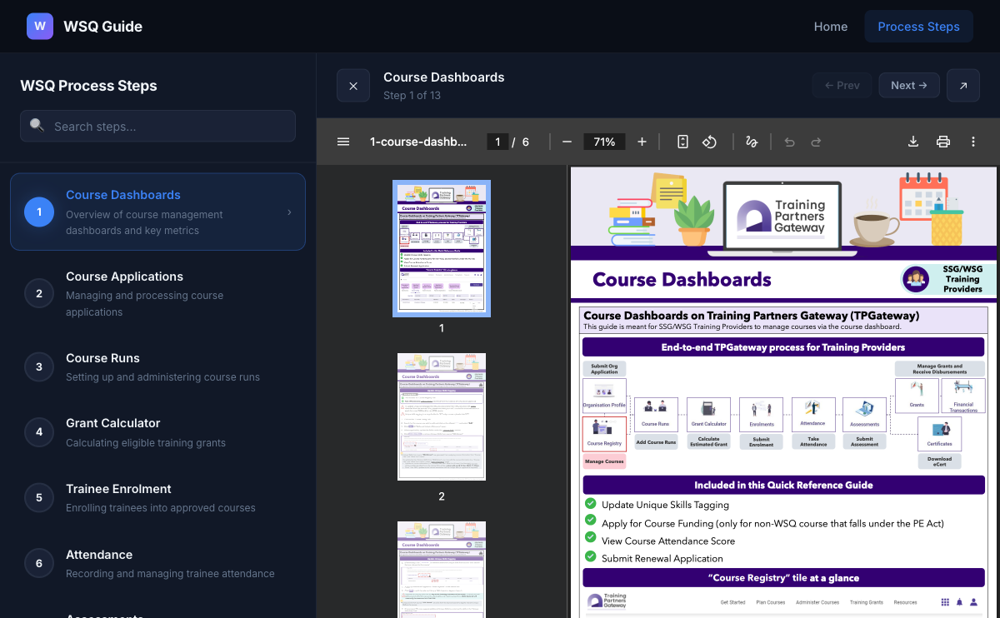

# SSG WSQ Process Guide

A modern, dark-themed interactive web app that guides users through the **SSG Workforce Skills Qualifications (WSQ)** process steps. Browse each stage of the WSQ workflow and view its detailed PDF documentation — all in one place.





## Features

- **13 Process Steps** — From Course Dashboards to Certificates, every stage of the WSQ workflow
- **Embedded PDF Viewer** — Read each process document directly in the app without downloading
- **Search & Filter** — Instantly find the step you need by keyword
- **Prev/Next Navigation** — Step through documents sequentially
- **Keyboard Shortcuts** — ESC to close, Arrow keys for prev/next
- **Session Persistence** — Remembers your last viewed step via localStorage
- **Responsive Design** — Works on desktop, tablet, and mobile
- **Accessible** — ARIA labels, keyboard navigation, semantic HTML

## Process Steps

| # | Step | Description |
|---|------|-------------|
| 1 | Course Dashboards | Overview of course management dashboards and key metrics |
| 2 | Course Applications | Managing and processing course applications |
| 3 | Course Runs | Setting up and administering course runs |
| 4 | Grant Calculator | Calculating eligible training grants |
| 5 | Trainee Enrolment | Enrolling trainees into approved courses |
| 6 | Attendance | Recording and managing trainee attendance |
| 7 | Assessments | Conducting assessments and recording results |
| 8 | Grants | Applying for and managing training grants |
| 9 | Claims | Submitting and tracking grant claims |
| 10 | Outcome Submission | Submitting training outcomes and competency results |
| 11 | Financial Transactions | Viewing and managing financial transactions |
| 12 | Refunds | Processing refund requests and adjustments |
| 13 | Certificates | Generating and issuing training certificates |

## Tech Stack

- HTML5
- CSS3 (Custom Properties, Flexbox, Grid, Animations)
- Vanilla JavaScript (ES6+)
- No frameworks or build tools required

## Getting Started

1. Clone the repository:
   ```bash
   git clone https://github.com/alfredang/ssgwsqprocess.git
   cd ssgwsqprocess
   ```

2. Start a local server:
   ```bash
   python3 -m http.server 8080
   ```

3. Open [http://localhost:8080](http://localhost:8080) in your browser.

## Project Structure

```
ssgwsqprocess/
├── index.html              # Landing page
├── steps.html              # Main process steps + PDF viewer
├── viewer.html             # Standalone PDF viewer
├── css/
│   └── styles.css          # Dark theme styles
├── js/
│   ├── app.js              # Shared data & utilities
│   ├── steps.js            # Steps page logic
│   └── viewer.js           # Viewer page logic
├── assets/
│   └── pdfs/               # 13 WSQ process PDFs
└── screenshots/            # App screenshots
```

## Deployment

This is a fully static site. Deploy to any static hosting:

- **GitHub Pages** — Enabled via GitHub Actions
- **Vercel** — `vercel deploy`
- **Netlify** — Drag and drop the project folder

## Live Demo

[https://alfredang.github.io/ssgwsqprocess/](https://alfredang.github.io/ssgwsqprocess/)

## License

MIT

---

Powered by [Tertiary Infotech Academy Pte Ltd](https://www.tertiarycourses.com.sg)
